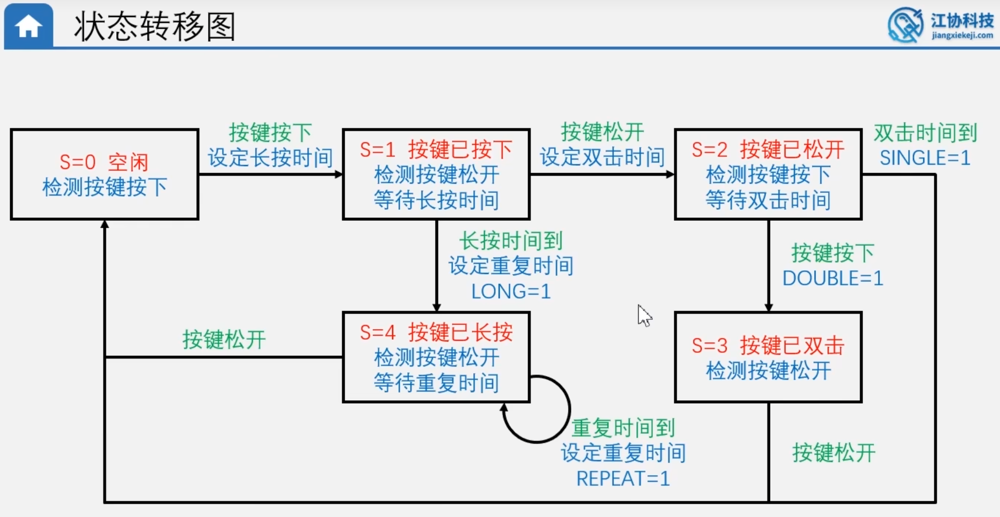
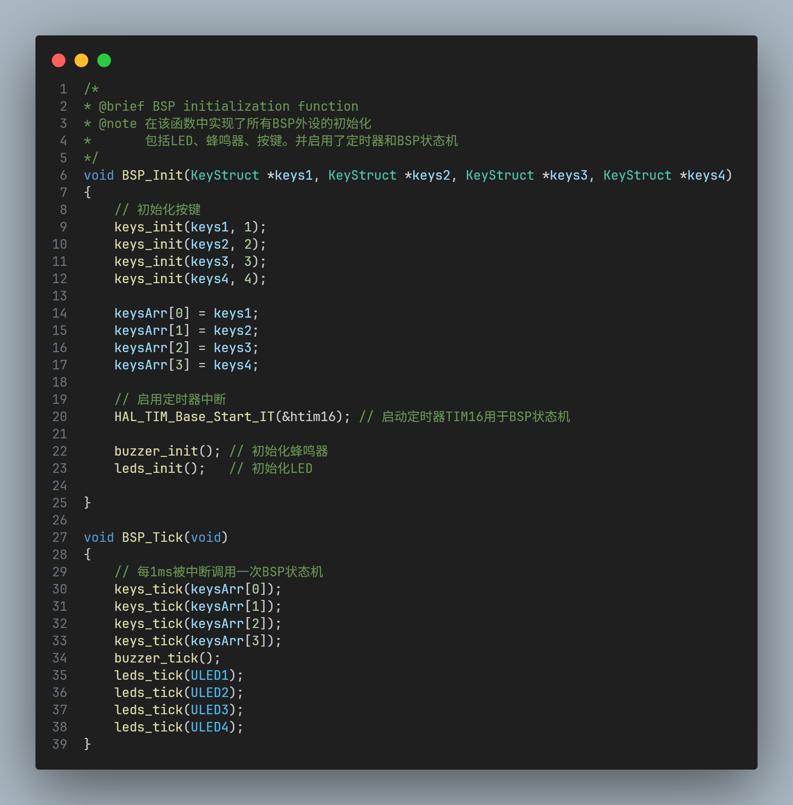

# BSP文件说明

## TIM

使用TIM16作为BSP库的状态机

## LEDs

## Buzzer蜂鸣器

## Keys按键

### 全功能非阻塞按键实现思路

1. 按键扫描
   1. 
2. 使用8位标志位表示按键状态
   1. 
3. 至标志位时刻
   1. 
4. 状态转移图！！⚠️⚠️重要
   1. 

## BSP使用说明

目前BSP初始化默认初始全部的4个按键，4个LED灯。若实际使用中太占用中断资源（主要是按键占用较多，请通过如下方式修改初始化个数）

1. 在BSP.c与BSP.h文件中更改`BSP_Tick（）`。删减对应按键的`keys_tick()`或`leds_tick()`使函数只调用对应按键或LED灯的tick函数

这样，中断函数中的状态机任务处理逻辑就能减少。

1. 头文件

   1. ```c
      #include "BSP.h"
      ```

2. 函数初始化

   - 请以如下格式

   - ```c
       KeyStruct keys1, keys2, keys3, keys4; // 定义按键结构体
       BSP_Init(&keys1, &keys2, &keys3, &keys4);
     ```

3. 函数使用

   - 蜂鸣器

     - ```c
     	buzzer_on();//开启蜂鸣器
     	buzzer_off();//关闭蜂鸣器
     	buzzer_last_on(duration);//蜂鸣器持续一段时间，单位ms
     	```
     
     
     
   - LED灯
   
     - 使用方式同上，注意传入指定LED灯作为参数
     
   - 按键
   
     - ```c
       uint8_t keys_readState(KeyStruct *keys, uint8_t flag_mask)
       ```
   
     - 请使用该函数直接获取按键状态。flag_mask表示各个标志位掩码，如下
   
       ```c
       // 对应标志位位掩码宏定义
       #define KEY_HOLD_MASK 0x01   // 按键长按标志位
       #define KEY_DOWN_MASK 0x02   // 按键按下标志位
       #define KEY_UP_MASK 0x04     // 按键松开标志位
       #define KEY_SINGLE_MASK 0x08 // 按键单击标志位
       #define KEY_DOUBLE_MASK 0x10 // 按键双击标志位
       #define KEY_LONG_MASK 0x20   // 按键长按标志位
       #define KEY_REPEAT_MASK 0x40 // 按键重复触发标志位
       
       ```
   
     - 函数返回0或1表示该标志位的状态
